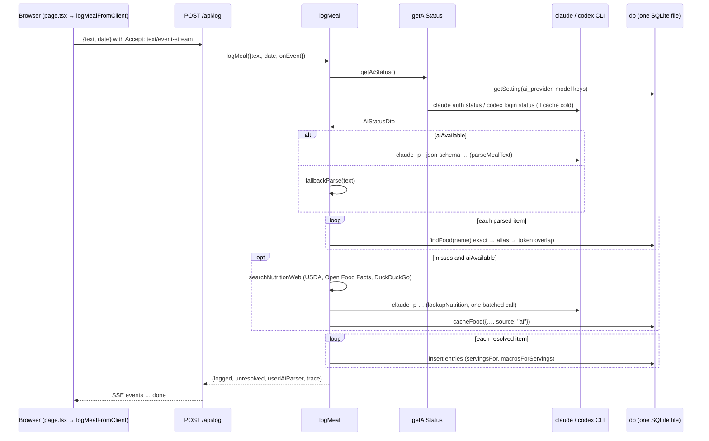

# How persistence, meal logging, and AI provider auth work today

Scope: the single-user Macro app as it exists at `a604c79`, read for the purpose of adding Google SSO, one SQLite file per user, and one Claude subscription per user. Explorer notes in `.audit/explorers/*.md` and `.audit/grounding.md` were checked against the code; where they disagreed, the code below is what is described.

### Overview

Macro is one Next.js 16 App Router process. Four client-rendered pages (`/`, `/history`, `/foods`, `/ai`) call nine route handlers under `src/app/api/`. Every handler reads and writes the same better-sqlite3 file through one process-wide handle exported as `db` from `src/db/index.ts`. Meal parsing and nutrition lookup shell out to the Claude Code or Codex CLI, and those CLIs read whatever credentials the server's own user has in `~/.claude` or `~/.codex`. There is no session, cookie, or identity anywhere: no `proxy.ts`, no auth check in any handler, and `Nav.tsx` has no identity slot. The README states the consequence outright: this is a single-user tool, and hosting it for other people against one Claude plan is disallowed.

For multi-user work, the whole app reduces to three shared things and a set of stateless request paths around them. The shared things are (1) the `db` singleton plus the `settings` table inside it, (2) the CLI credential home plus the host process environment that `claudeChildEnv()` copies into every spawned CLI, and (3) two process-wide caches: the 30-second `statusCache` in `src/lib/ai/index.ts` and the in-flight login map `globalThis.__macroAiLogins` in `src/lib/ai/login.ts`. Everything else derives from a request and can stay as it is once those three are keyed by user.

### Key Concepts

**Tables.** `src/db/schema.ts` defines four Drizzle tables. `foods` is the catalog: ~110 seeded rows plus rows cached from AI lookups or added by hand, with `normalized_name` UNIQUE and `source` in `seed|ai|user`. `entries` are meal rows keyed by a `date` string `YYYY-MM-DD`, denormalizing `food_name` and macros so history survives food edits (`food_id` is `ON DELETE SET NULL`). `goals` is a single row with `id = 1`. `settings` is a key/value table. Ids are per-file SQLite autoincrement.

**`db` singleton.** `src/db/index.ts` exports `db` as a `Proxy`. Every property access calls `getDb()`, which lazily runs `createDb()` once and stores the Drizzle instance on `globalThis.__calorieLoggerDb` and the raw handle on `globalThis.__calorieLoggerSqlite`. `resolveDbPath()` picks the file: explicit argument, then `CALORIE_LOGGER_DB_PATH`, then `os.tmpdir()/calorie-logger.db` when `VERCEL` is set, else `data/app.db`. `resetDbForTests(path)` and `clearEntriesForTests()` are the only mutators of that global.

**Settings keys** (`src/lib/settings.ts`): `ai_provider`, `claude_oauth_token`, `ai_claude_model`, `ai_codex_model`, `ai_openai_model`. `getSetting`/`setSetting`/`deleteSetting` all go through `db`.

**Provider.** `AiProvider` in `src/lib/ai/types.ts` is `{ id, label, isAvailable(), generateJson(req) }`. Three implementations live in `src/lib/ai/providers/`: `claude` (spawns `claude`), `codex` (spawns `codex`), `openai` (SDK with `OPENAI_API_KEY`). `resolveAiStatusView()` in `select.ts` is the pure picker; `AUTO_ORDER` is `["claude", "codex"]` and OpenAI is never auto-selected.

**`AiStatusDto`.** The object `GET /api/status` returns and `logMeal` consults: `aiAvailable`, `provider`, `providerLabel`, `selection`, per-provider `providers[]`, `bannerKind` (`ok|none|api_key`), `bannerMessage`, `logins[]` (every in-flight login session), `models`, `modelCatalog`, `activeModel`.

**Child env builders.** `claudeChildEnv()` and `codexChildEnv()` in `src/lib/ai/env.ts` construct the environment for every CLI spawn: the availability probe, the `-p`/`exec` call, `auth login`, and `auth logout`. They are the single seam that decides which credential store and which token a CLI sees.

**Login session.** `src/lib/ai/login.ts` keeps `Map<sessionId, LoginSession>` on `globalThis.__macroAiLogins`. Each entry holds the live `ChildProcess` of a `claude auth login --claudeai` or `codex login --device-auth` run plus a public DTO (`sessionId`, `provider`, `loginUrl`, `userCode`, `expiresAt`, `phase`).

**Date convention.** The UI sends `todayLocalDate()` (local calendar, `src/lib/types.ts`). `/api/log` and `/api/entries` fall back to UTC `new Date().toISOString().slice(0, 10)` when no `date` is given. `/api/history` computes `since` from UTC.

**Test harness.** `setupTempDatabase()` in `src/test/helpers.ts` calls `resetDbForTests` on a fresh temp file and wipes entries, settings, and non-seed foods before each test. Route handlers are imported and invoked directly with a `NextRequest` built by `jsonRequest()`. `src/test/setup.ts` mocks the Claude and Codex providers as "CLI not installed" for the whole suite, so `logMeal` in tests always takes the built-in parser. CLI login tests point `AI_CLAUDE_BIN`/`AI_CODEX_BIN` at fake scripts in `src/lib/ai/fixtures/`.

### How It Works

#### Opening the database

Nothing opens the database at boot. The first `db.select()` anywhere triggers `getDb()` → `createDb()`. `createDb` does `mkdirSync` on the parent directory, opens the file with better-sqlite3, sets `journal_mode = WAL` and `foreign_keys = ON`, runs the `CREATE TABLE IF NOT EXISTS` DDL string, upserts the `goals` row `id = 1` with defaults 2000/120/225/65, and if `SELECT COUNT(*) FROM foods` is zero, inserts `SEED_FOODS` from `src/db/seed-data.ts` with `ON CONFLICT(normalized_name) DO NOTHING`. The Drizzle instance is then pinned on `globalThis` so Next dev's module reloads reuse the handle instead of leaking one per HMR cycle.

The `Proxy` exists for tests, not production: `resetDbForTests(path)` closes the old handle, clears both globals, sets `process.env.CALORIE_LOGGER_DB_PATH = path` (so a later no-arg `createDb()` reopens the same test file), and creates a new one. Because every `import { db }` binding resolves `getDb()` at access time, the swap is visible everywhere without re-importing. That property makes `getDb()` the natural place to introduce request-scoped resolution, but see Gotchas for why a mutable global pointer is not the way to do it.

All better-sqlite3 calls are synchronous. Handlers never `await` between a read and its dependent write except in `logMeal`, where awaits on AI calls sit between `findFood` and the `entries` insert.

#### Reading and writing data

Every handler imports `{ db }` and queries directly. None reads a cookie, header, or identity.

| Route | Handler file | Touches |
| --- | --- | --- |
| `GET /api/entries?date=` | `src/app/api/entries/route.ts` | `entries` for the day ordered by `logged_at`, computed totals, `goals` row 1 |
| `PATCH/DELETE /api/entries/:id` | `src/app/api/entries/[id]/route.ts` | `entries` by integer id; PATCH recomputes macros via `foods` when `food_id` is set, else scales |
| `GET/POST /api/foods` | `src/app/api/foods/route.ts` | `foods` list or `LIKE` search; POST calls `cacheFood(..., source: "user")` |
| `PATCH/DELETE /api/foods/:id` | `src/app/api/foods/[id]/route.ts` | `foods` by integer id |
| `GET/PUT /api/goals` | `src/app/api/goals/route.ts` | `goals` where `id = 1`; `GET()` takes no request argument |
| `GET /api/history?days=` | `src/app/api/history/route.ts` | `entries` grouped by `date` since a UTC cutoff, 1..365 days |
| `POST /api/log` | `src/app/api/log/route.ts` | see next section |
| `GET /api/status` | `src/app/api/status/route.ts` | `getAiStatus()` only |
| `POST /api/ai` | `src/app/api/ai/route.ts` | login store, `settings`, `getAiStatus()` |

Row ids carry no owner. `DELETE /api/entries/7` deletes whatever row 7 is in the one file. `cacheFood` dedupes on `normalized_name` and returns the existing row on collision, so a food name can exist once per file regardless of who added it.

#### Logging a meal

`POST /api/log` is the one path that composes persistence and AI. `logMeal()` in `src/lib/log-meal.ts` does the work; the route only handles transport.



Step by step:

1. The route trims `body.text` (400 if empty) and accepts `body.date` only if it matches `^\d{4}-\d{2}-\d{2}$`, else UTC today. `wantsStream()` checks `Accept` and `?stream=1`. The UI always streams (`src/lib/log-client.ts`); tests and the AGENTS.md smoke use plain JSON.
2. `logMeal` calls `getAiStatus()` first. If `aiAvailable`, it calls `parseMealText()`, which asks the active provider for `{ items: [{name, quantity, unit}], reasoning }` under `PARSE_JSON_SCHEMA`; any throw falls back to `fallbackParse()` (regex quantity/unit/name splitting, `src/lib/fallback-parse.ts`). If AI is off it goes straight to `fallbackParse`.
3. Each item goes through `findFood()` in `src/lib/food-lookup.ts`: exact `normalized_name`, then alias membership, then a token-overlap score with a 50% coverage floor so "dragonfruit smoothie bowl" does not collapse into "Smoothie".
4. Misses: if AI is off, each becomes `unresolved` with `status.bannerMessage` as the reason. If AI is on, `lookupNutrition()` runs `searchNutritionWeb()` per name (USDA with `USDA_API_KEY` or `DEMO_KEY`, Open Food Facts, DuckDuckGo HTML), then one batched `generateJson` call under `BATCH_NUTRITION_JSON_SCHEMA`, and `cacheFood({..., source: "ai"})` writes each result into `foods`.
5. Resolved items become `entries` rows via `db.insert(entries).values({...}).returning().get()`, one insert per item, no transaction. `rawInput` stores the whole sentence on every row.
6. Response: the JSON path returns 422 with the trace when nothing was logged or unresolved, else 200 with `logged`, `unresolved`, `usedAiParser`, `trace`. The SSE path is always HTTP 200; failures arrive as an `error` event, and the client reads `logged`/`unresolved` from the `done` event.

The only persistence in this flow is `findFood`, `cacheFood`, and the `entries` insert, all via `db`. The only identity-shaped inputs are the CLI credentials `getAiStatus`/`parseMealText`/`lookupNutrition` end up using.

#### Deciding whether AI is available

`getAiStatus()` in `src/lib/ai/index.ts` is called by `GET /api/status`, by every `POST /api/ai` action that returns a status, by `logMeal`, and again inside `requireProvider()` for each AI call. It returns `statusCache.value` if it is under 30 seconds old. Otherwise:

1. `readSelection()`: `process.env.AI_PROVIDER || getSetting("ai_provider") || "auto"`. Env wins over the in-app choice.
2. `probeAll()`: runs all three `isAvailable()` in parallel. Claude spawns `claude auth status` (15 s timeout) with `claudeChildEnv()` and parses JSON via `interpretClaudeAuthStatus()`; Codex spawns `codex login status` with `codexChildEnv()`; OpenAI checks `OPENAI_API_KEY`. Both CLI probes short-circuit to `cliInstalled: false` when `cliIsInstalled()` cannot find the binary on the child `PATH`.
3. `resolveAiStatusView()`: `none` → no provider; `auto` → first available in `["claude", "codex"]`; explicit id → that provider if available. `bannerKind: "api_key"` is set when `interpretClaudeAuthStatus` reported `reason: "api_key"` (an `apiKeySource`, `authMethod: "api_key"`, or a `claude.ai` login with `subscriptionType` null) or when `hasStrayAnthropicKey()` sees `ANTHROPIC_API_KEY`/`ANTHROPIC_AUTH_TOKEN` in the server env.
4. Models: `selectedModelId()` per provider, where the in-app setting wins over `AI_CLAUDE_MODEL`/`AI_CODEX_MODEL`/`OPENAI_MODEL`, the reverse of the provider precedence.
5. `logins: activeLogins()` copies every public login DTO in the store into the response.

`clearAiStatusCache()` is called by `complete`, `poll` (when done), `disconnect`, `token`, and `preference`. It is not called by `connect`, so a freshly started login shows up in `/api/status.logins` only when the cache expires.

#### Talking to the CLIs

Every spawn goes through `runCli()` in `src/lib/ai/run-cli.ts` (pipe stdio, timeout with SIGTERM then SIGKILL, 10 MB buffer cap, `CliError` with an `ENOENT` code translated by `publicCliErrorMessage()` so raw spawn errors never reach the browser). The binary comes from `claudeBin()`/`codexBin()`: `AI_CLAUDE_BIN`/`AI_CODEX_BIN` override, else `~/.local/bin/<name>` if it exists, else bare name on `PATH`. `scripts/install-ai-clis.sh` installs both into `~/.local/bin`.

`claudeChildEnv()` builds the environment as follows, in order: copy `process.env`; prepend `~/.local/bin` to `PATH`; `dropScratchHomes()` deletes `CODEX_HOME` and `CLAUDE_CONFIG_DIR` if their value is `/tmp` or starts with `/tmp/`; `sanitizeHostEnv()` deletes `DISPLAY`, `CURSOR_*`, `TMUX*` and forces `TERM=dumb`, `NO_COLOR=1`, `BROWSER=true` (so `claude auth login` prints the URL instead of opening a browser, and prints it without OSC-8 wrapping); delete `ANTHROPIC_API_KEY` and `ANTHROPIC_AUTH_TOKEN`; then compute `token = process.env.CLAUDE_CODE_OAUTH_TOKEN || getSetting("claude_oauth_token")`, delete the env var, and re-add it only if `token` is set. `codexChildEnv()` is the same minus the token step and deletes `OPENAI_API_KEY`/`CODEX_API_KEY` instead.

What that means for credentials: with no `CLAUDE_CODE_OAUTH_TOKEN`, the CLI reads its stored login from its config directory, `~/.claude` by default and relocatable with `CLAUDE_CONFIG_DIR` (Codex: `~/.codex`, `CODEX_HOME`). `scripts/ai-cli-smoke.ts` already uses exactly those two variables to give itself a scratch home; production never sets them and actively strips `/tmp`-based ones. So today, the "who is logged in to Claude" answer is "whoever last ran `claude auth login` as the server's OS user", for every request.

The parse call is `claude -p --output-format json --json-schema <schema> --system-prompt <system> --tools "" --strict-mcp-config --max-turns 2 --no-session-persistence [--model m]` with the user text on stdin and a throwaway `mkdtemp` cwd under `/tmp/macro-claude-*` (`src/lib/ai/cli-args.ts`, `providers/claude.ts`). `interpretClaudePrintResult()` refuses to trust `subtype: "success"`; an unauthenticated run returns `is_error: true, terminal_reason: "api_error"` with no `structured_output` and exit 1. Codex is `codex exec - --output-schema schema.json -o out.json --sandbox read-only --skip-git-repo-check --ephemeral --color never [-m m]`.

#### Connecting a subscription

`POST /api/ai` is a single handler switching on `body.action`. Errors from any branch become 400 with `publicCliErrorMessage(err)`.

```mermaid
sequenceDiagram
    participant U as /ai page
    participant A as POST /api/ai
    participant L as login.ts store (globalThis.__macroAiLogins)
    participant P as claude auth login --claudeai (child)
    participant H as ~/.claude (server user's CLI home)

    U->>A: {action: "connect", provider: "claude"}
    A->>L: startClaudeLogin()  → cancelProvider("claude") kills every Claude login in the map
    L->>P: spawn with claudeChildEnv(), wait ≤20 s for a URL
    P-->>L: authorize URL on stdout
    L-->>U: {login: {sessionId, loginUrl, phase: "awaiting_user", expiresAt: +10 min}}
    U->>U: user opens URL, signs in, copies code
    U->>A: {action: "complete", sessionId, code}
    A->>L: completeClaudeLogin() writes code + "\n" to child stdin, waits ≤60 s
    P->>H: CLI writes OAuth credentials
    P-->>L: exit 0
    L-->>A: phase "done", removed from map
    A->>A: clearAiStatusCache(); getAiStatus() re-probes
    A-->>U: {login, status}
```

Actions in detail:

- `connect` (`provider: claude|codex`): `startClaudeLogin()` or `startCodexLogin()`. Both first call `cancelProvider(kind)`, which SIGTERMs and deletes every session of that provider in the map, then `spawnUntilParsed()` (which refuses to spawn a missing binary via `requireCliInstalled`) and store a session with a TTL timer (10 min Claude, 15 min Codex) that flips `phase` to `failed` and kills the child on expiry. Codex device auth prints a URL and a `userCode`; the child completes on its own when the user finishes in the browser, and its `close` handler flips `phase` to `done` on exit 0.
- `complete` (`sessionId`, `code`): Claude only. Writes the code to stdin, waits for exit, marks done or failed, clears the status cache, returns fresh status.
- `poll` (`sessionId`): `getLogin()`; 404 if unknown. Used by the AI page every 2 s for Codex. Deletes the session on the read that observes `done`.
- `cancel` (`sessionId`): `cancelLogin()` kills and deletes.
- `disconnect` (`provider`): `logoutProvider()` cancels in-flight logins of that kind and runs `claude auth logout` / `codex logout` with the child env, then for Claude `deleteSetting("claude_oauth_token")`, clears the cache.
- `token` (`token`): `validateClaudeSetupToken()` accepts `sk-ant-oat…` and rejects `sk-ant-api…`/`sk-…` API keys, then `setSetting("claude_oauth_token")`. This is the headless path: the token is re-injected as `CLAUDE_CODE_OAUTH_TOKEN` by `claudeChildEnv()` on every spawn.
- `preference` (`selection`, `models`): writes `ai_provider` and the per-provider model keys (`normalizeModelId` + `isAllowedModelId`; empty string means CLI default and deletes the key, except OpenAI which resets to `gpt-4o-mini`), clears the cache.

Nothing in this handler identifies a caller. Any client can `connect`, `poll`, or `cancel` any `sessionId`, and `GET /api/status` hands out every `sessionId`, `loginUrl`, and `userCode` currently in the map.

#### What the UI does

All four pages are `"use client"` components that `fetch` on mount and hold results in React state; there is no server component data loading, no `localStorage`, and no shared store. `src/app/layout.tsx` renders `Nav` and `children` with no session lookup. `fetch` uses same-origin defaults, so a session cookie set by an auth callback will ride along on every existing call without client changes.

- `/` (`src/app/page.tsx`): fetches `/api/entries?date=<local today>` and `/api/status`; renders the `api_key` or `none` banner from `bannerKind`, `AiPicker` (posts `preference`), `MacroDashboard`, `EntryList` (PATCH/DELETE `/api/entries/:id`), `LogComposer` + `SpeechInput`, and `ThoughtProcess` fed by SSE events from `logMealFromClient`.
- `/history`: fetches `/api/history?days=60` and `/api/goals`; on expanding a day, fetches `/api/entries?date=` once and caches it in `dayEntries` state.
- `/foods`: fetches `/api/foods[?q=]` and `/api/goals`; edits go to `PATCH/DELETE /api/foods/:id` and `PUT /api/goals`.
- `/ai` (`src/app/ai/page.tsx`): fetches `/api/status`, and if `d.logins` contains an `awaiting_user`/`completing` session it adopts it as the page's `login` state, so any tab picks up any in-flight login. Connect/complete/cancel/disconnect/token/preference all post to `/api/ai`.

None of the pages checks `res.ok`. `setEntries(data.entries)` with a 401 JSON body sets `undefined`, and `EntryList` throws on `entries.length` at the next render; History's `days.map` and Foods' `foodList` fail the same way.

#### Test and verification harnesses

`npm test` (Vitest, `pool: "forks"`, `fileParallelism: false`) runs unit tests plus API/DB integration tests that call handlers directly on a temp file. `src/test/setup.ts` mocks the Claude and Codex providers, so no test spawns a real CLI; login tests use fake binaries and dump the child env to a file to assert `TERM=dumb`, stripped keys, and OSC-8 URL parsing. `npm run test:e2e` (Playwright, one worker, serial) boots `next dev` with `CALORIE_LOGGER_DB_PATH` in tmpdir, `AI_PROVIDER=none`, fake `AI_CLAUDE_BIN`/`AI_CODEX_BIN`, and drives `/`, `/ai`, `/history`, `/foods` with no cookies. The `verify-macro` skill (`.cursor/skills/verify-macro/`) launches the same way on a free port with its own `NEXT_DIST_DIR`, requires `GET /api/status` to answer with `bannerKind: "none"` as its doctor check, and drives the UI cookie-less. `scripts/ai-doctor.ts` imports `getAiStatus`/`parseMealText` in-process and needs a live login. CI (`.github/workflows/test.yml`) runs `npm test` and `npm run lint`.

The committed `src/app/api/auth.isolation.test.ts` fails today by design. It pins the target contract: the listed handlers return 401 with no cookie; `@/lib/auth/session` exports `mintTestSession({ email, name })` resolving to a cookie header string; user B's `GET /api/entries` omits A's entry; B's `PATCH`/`DELETE` on A's id returns 404, not 403.

#### Shared-state inventory

Everything below is process-wide today and must become per-user (or be dropped) for isolation. The "seam" column is the function whose signature or lookup has to learn about a user.

| Shared today | Where | Seam |
| --- | --- | --- |
| SQLite file and Drizzle handle | `globalThis.__calorieLoggerDb`, `__calorieLoggerSqlite` | `getDb()` in `src/db/index.ts`; every `import { db }` resolves through it |
| `settings` rows (`ai_provider`, models, `claude_oauth_token`) | same file | `getSetting`/`setSetting` in `src/lib/settings.ts` |
| Goals row `id = 1`, foods catalog, entries | same file | falls out of per-user files |
| CLI credential home | `~/.claude`, `~/.codex` of the server user | `claudeChildEnv()`/`codexChildEnv()` must set `CLAUDE_CONFIG_DIR`/`CODEX_HOME`, and `dropScratchHomes` must not remove them |
| Host env overrides | `AI_PROVIDER`, `CLAUDE_CODE_OAUTH_TOKEN`, `AI_*_MODEL` | `readSelection()`, `claudeChildEnv()`, `resolveModelFor()` |
| Provider availability cache | module `statusCache` in `src/lib/ai/index.ts` | `getAiStatus()`/`clearAiStatusCache()` |
| In-flight login sessions and child processes | `globalThis.__macroAiLogins` | `store()`, `cancelProvider()`, `activeLogins()`, `getLogin()` in `login.ts` |
| OpenAI client and key | module `client`, `OPENAI_API_KEY` | operator-level by design; never auto-selected |
| USDA quota | `USDA_API_KEY` or `DEMO_KEY` | shared by design |

### Where Things Live

- `src/db/schema.ts` tables and inferred types; `src/db/index.ts` DDL, `resolveDbPath`, `createDb`, the `db` Proxy, `resetDbForTests`, `clearEntriesForTests`; `src/db/seed-data.ts` the ~110 seed foods.
- `src/lib/settings.ts` key constants and get/set/delete.
- `src/lib/log-meal.ts` the meal pipeline; `src/lib/food-lookup.ts` `findFood`/`cacheFood`; `src/lib/fallback-parse.ts` the built-in parser; `src/lib/units.ts` serving math; `src/lib/log-trace.ts` SSE event types and encoding; `src/lib/log-client.ts` browser-side SSE consumer; `src/lib/nutrition-search.ts` USDA/OFF/DuckDuckGo.
- `src/lib/ai/index.ts` `getAiStatus`, `parseMealText`, `lookupNutrition`, `statusCache`; `select.ts` pure provider pick; `models.ts` catalog and precedence; `env.ts` child env and binary resolution; `run-cli.ts` spawn wrapper; `cli-args.ts` locked argv; `claude-parse.ts` and `login-parse.ts` output parsers; `login.ts` session store; `setup-token.ts` token validation; `providers/{claude,codex,openai}.ts`.
- `src/app/api/{log,entries,entries/[id],foods,foods/[id],goals,history,status,ai}/route.ts` handlers.
- `src/app/{page,history/page,foods/page,ai/page}.tsx` pages; `src/app/layout.tsx`; `src/components/Nav.tsx`, `EntryList.tsx`, `AiPicker.tsx`, `LogComposer.tsx`, `MacroDashboard.tsx`, `ThoughtProcess.tsx`, `SpeechInput.tsx`.
- `src/test/helpers.ts`, `src/test/setup.ts`; `src/app/api/{rest,log}.integration.test.ts`; `src/app/api/auth.isolation.test.ts` (failing target); `src/lib/ai/fixtures/` fake CLIs.
- `e2e/app.spec.ts`, `playwright.config.ts`; `.cursor/skills/verify-macro/` and its `scripts/control-macro.mjs`; `scripts/ai-doctor.ts`, `scripts/ai-cli-smoke.ts`, `scripts/install-ai-clis.sh`.
- `README.md`, `.env.example`, `AGENTS.md` (smoke: `POST /api/log` then `GET /api/entries?date=`).
- Next 16 docs that apply: `node_modules/next/dist/docs/01-app/03-api-reference/03-file-conventions/proxy.md` and `01-app/02-guides/authentication.md`.

### Gotchas

- **Next 16 has `proxy.ts`, not `middleware.ts`.** The middleware convention is deprecated and renamed. Proxy runs on the Node.js runtime here, but the docs say not to rely on shared modules or globals from it and to keep it to optimistic cookie checks and redirects. The real gate has to live in each handler or a shared `requireSession(req)` they all call; hiding UI is not a gate.
- **Handlers are invoked directly in tests.** `auth.isolation.test.ts` and the existing integration tests call `GET(req)`/`POST(req)` with a hand-built `NextRequest`. Session verification therefore has to read `req.cookies`/`req.headers.get("cookie")`; `cookies()` from `next/headers` throws "`cookies` was called outside a request scope" (`work-unit-async-storage.external.js`) when there is no Next request context. `goals`'s `GET()` currently takes no request argument and will need one.
- **The singleton pointer cannot be swapped per request.** One Node process serves concurrent users, and `logMeal` awaits CLI calls between `findFood` and the `entries` insert. Reassigning `globalThis.__calorieLoggerDb` per request would let user B's handle be current when A's insert runs. Resolution has to travel with the request (an `AsyncLocalStorage` consulted inside `getDb()`, or an explicit `db` parameter). Because every call site already goes through `getDb()` on each property access, a context-aware `getDb()` reaches all nine production import sites (`settings.ts`, `log-meal.ts`, `food-lookup.ts`, and the six data route files) without editing them. `resetDbForTests` mutating `process.env.CALORIE_LOGGER_DB_PATH` is part of the existing test contract and must keep working.
- **Ids are per file.** With separate SQLite files, A's entry 1 and B's entry 1 are different rows. "B cannot PATCH A's id" is satisfied by routing B to B's file, where the id resolves to B's own row or to nothing (the committed test expects 404). Never treat an integer id as globally meaningful.
- **`CREATE TABLE IF NOT EXISTS` does not migrate.** Existing files never gain new columns. A user catalog (email, name, file path) is a new table in a new file, not a column on `app.db`. Adopting a legacy `data/app.db` as the first user's file is fine because its schema is already complete.
- **WAL sidecars.** Each file has `-wal` and `-shm` companions. Test cleanup deletes all three; per-user directories need the same, and handles are never closed in production today, so a per-user handle map needs a close/evict story.
- **`dropScratchHomes` deletes `/tmp` config dirs.** Any per-user `CLAUDE_CONFIG_DIR`/`CODEX_HOME` under `/tmp` is silently removed before spawn and the CLI falls back to `~/.claude`. Put per-user CLI homes under `data/users/<id>/` or change the rule. `env.test.ts` asserts the current `/tmp` behaviour.
- **Host env beats the store for provider and token, but not for model.** `AI_PROVIDER` overrides `settings.ai_provider`; `CLAUDE_CODE_OAUTH_TOKEN` overrides `settings.claude_oauth_token` and survives `disconnect`. After SSO a host-level token would silently become every user's credential. Model precedence is the opposite (setting first, then `AI_CLAUDE_MODEL`). Playwright and verify-macro rely on `AI_PROVIDER=none` and fake `AI_*_BIN` paths, so the override path must stay for tests.
- **`/api/status` leaks every in-flight login.** `logins: activeLogins()` includes `sessionId`, `loginUrl`, and Codex `userCode` for all sessions, and the AI page adopts any of them on mount. Any tab can complete, cancel, or hijack another user's connect. `connect` does not clear the status cache, so the list also lags up to 30 s.
- **`cancelProvider` is process-wide.** `startClaudeLogin()` kills every Claude login in the map before starting its own. Two users connecting at once cancel each other. The login map needs a user key.
- **`getAiStatus` runs inside every meal log.** A cold cache spawns `claude auth status` and `codex login status` (up to 15 s each, in parallel) on the request path. Keying the cache per user multiplies probes by users; keep the TTL and consider probing only the selected provider.
- **`claudeChildEnv()` reads the database.** It calls `getSetting("claude_oauth_token")`, so building a CLI environment already depends on which database is current. Per-user env and per-user db have to be resolved together.
- **The SSE path is always HTTP 200.** `POST /api/log?stream=1` opens the stream before any failure can be reported. Authenticate before constructing the `ReadableStream`, or a 401 turns into an `error` event that the composer displays as a parse failure.
- **Clients ignore `res.ok`.** A 401 body without `entries`/`foods`/`goals` throws in render. Gating the API without a sign-in page and `ok` checks breaks every page. React state (`dayEntries` on History, `token` and `login` on AI, `entries` on Today) is the only cache, so a same-tab identity change needs a full reload after sign-out.
- **Dates mix local and UTC.** The UI sends local `todayLocalDate()`; `/api/log` and `/api/entries` default to UTC when `date` is absent; `/api/history` cuts off by UTC. Always pass `date` from tests and smoke scripts.
- **Vercel is a different persistence story.** `resolveDbPath` puts the single file in `os.tmpdir()` when `VERCEL` is set: one file per isolate, empty on cold start, CLIs not installed. Per-user files there die the same way; isolation targets durable hosts, and the tmpdir branch should stay so the hosted demo keeps working.
- **One plan, many users is disallowed.** README: "Do not host it for other people against your subscription." Per-user Claude credentials are a compliance requirement of the multi-user change, not an enhancement. `OPENAI_API_KEY` and `USDA_API_KEY` remain operator-level.
- **Every existing harness assumes open APIs.** Integration tests, Playwright, verify-macro's doctor (`GET /api/status` must answer), and the AGENTS.md smoke all run cookie-less. They need a minted session (behind an explicit test-only env flag that production refuses), not a public exception for `/api/status`.
